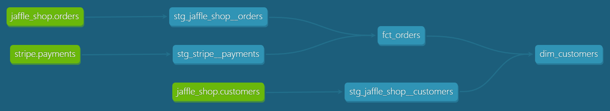
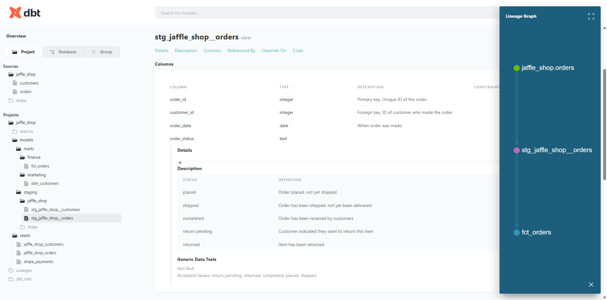

# Modern Data Stack - jaffle_shop (dbt + Postgres/Docker)

[](https://www.python.org/)
[](https://www.getdbt.com/)
[](https://www.postgresql.org/)
[](https://www.docker.com/)
[](LICENSE)

This project was created to better understand modern analytics engineering workflows built around dbt.

While the same transformations could technically be implemented directly in a warehouse such as Snowflake or PostgreSQL, dbt provides critical engineering capabilities around:

* dependency management
* modular SQL transformations
* automated testing
* documentation
* lineage visualization
* reusable data quality patterns

The goal of this project was to practice treating analytics transformations as maintainable software rather than isolated SQL scripts.

---

## Architecture & Tech Stack

The project replicates a cloud-like data warehouse environment using localized, containerized infrastructure.

* **Data Transformation:** `dbt-core` (version `1.10.8` for syntax stability).
* **Database:** `PostgreSQL 16` running inside a **Docker** container (simulating a cloud data warehouse).
* **Development Environment:** VS Code with custom extensions to handle Jinja SQL and YAML configurations.
* **Project Lineage**:

   

---

## Key Features Implemented

1. **Containerized Database:** Setting up the database infrastructure via `docker-compose` with persistent storage volumes.
2. **Staging Layer (stg):** Cleaning raw data (from Stripe and Jaffle Shop sources), unifying column naming conventions, and standardizing data types using the `{{ source() }}` macro.
3. **Automated Testing:**

    * Implemented built-in generic tests (`unique`, `not_null`, `accepted_values`, `relationships` using the updated dbt 1.10+ syntax).
    * Created reusable custom generic tests for business rule validation (e.g., ensuring numeric amounts are never negative).

4. **Project Configuration:** Fully resolved compiler warnings (`dbt parse`), properly isolated the environment via `.gitignore`, and streamlined model materializations in `dbt_project.yml`.

5. **Documentation:**

   

---

## Local Setup

1. Spin up the Postgres database in Docker:

```text
   docker compose up -d
```

Activate your virtual environment and install the required packages (using strict versions to avoid pip dependency conflicts):

```text
   .venv\Scripts\activate
   pip install dbt-core==1.10.8 dbt-postgres==1.9.0
```

Load raw seed data, build models, and run the tests using a single command::

```text
   dbt build
```
